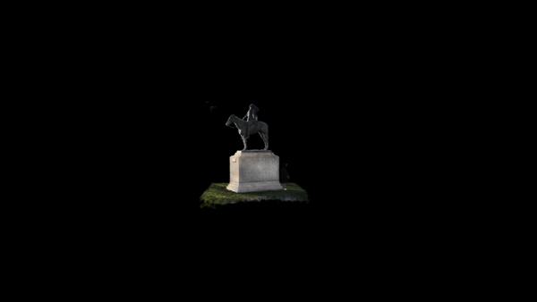
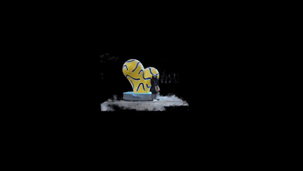
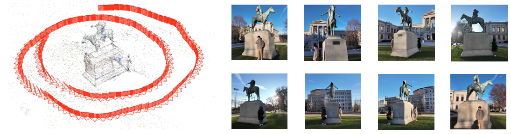
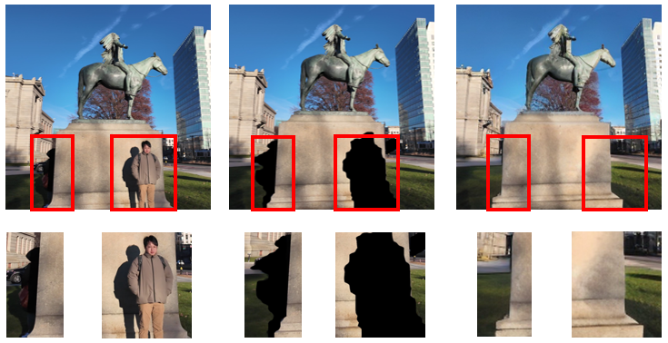
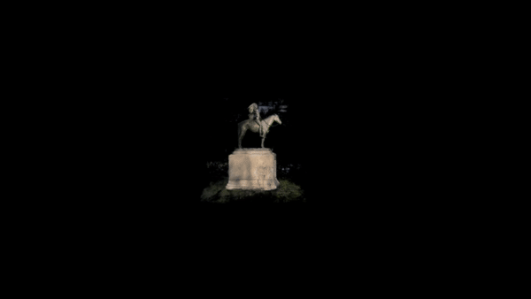
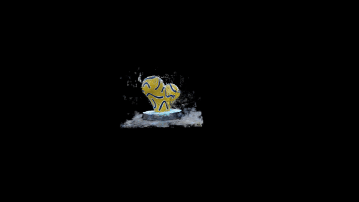

# Eliminating irrelevant Objects in 3D Reconstruction Using NeRF

## Introduction
[NeRF](http://www.matthewtancik.com/nerf) (Neural Radiance Fields) is a method that achieves state-of-the-art results for synthesizing novel views of complex scenes. Here are some videos generated by this repository (pre-trained models are provided below):


However, NeRF often struggles when the training images include distracted or dynamic elements, such as tourists around a landmark, which detract from the target subject. We propose a novel pipeline that enhances NeRF’s robustness by integrating advanced computer vision techniques. **The pipeline employs image segmentation to accurately identify and mask unwanted objects, followed by inpainting using stable diffusion models to seamlessly fill the masked areas with contextually appropriate content.**
   

## Installation

```
git clone https://github.com/
cd nerf-pytorch
pip install -r requirements.txt
```

You will also need the [LLFF code](http://github.com/fyusion/llff) (and COLMAP) set up to compute poses if you want to run on your own real data.

Ensure your environment has CUDA installed (if using a GPU).
</details>

## How To Run?

### Quick Start

### Download data for two self-made example datasets: 
```
https://drive.google.com/drive/folders/1cB8RkMtZgCBZwEQstQedPKhxtRgbPuLH?usp=sharing
```
Visual Samples from the Horse Statue Datasets: This dataset captures photographs of the horse statue located in front of the Museum of Fine Arts in Boston, following a spiral shooting path. 




### Steps to Run the Preprocessing Pipeline
1. Configure image_util.py: The image_util.py script is designed to:

+ Perform segmentation using Mask2Former.
+ Generate a mask for the target objects.
+ Apply the mask overlay to the original image.
+ Use Stable Diffusion for image inpainting.
**Change the input and output paths of your image collection**
```
    input_folder = 'replace your dataset path'
    segmented_output_folder = 'replace your segmented_imgs folder path'
    mask_output_folder = 'replace your output mask matrix[0,1] file'# 0 represents no building, 1 represents building. 
    inpaint_img_folder = 'your output inpaint images folder path'# It is best to generate inpaint in the data directory with name of images
```
After preprocessing pipeline, you can get three images folders, segmented image folder, mask matrix folder and inpaint images.
you can analyze your preprocessing effect and fine tune your model on different parameters.
Here is an example of a random image in our dataset.


To train a `horse statue` NeRF:
```
python run_nerf.py --config configs/horse_statue.txt
```
After training for 50k iterations (~4 hours on a single 4080 Ti), you can find the following video at `logs/horse_statue_test/horse_statue_test_spiral_50000_rgb.mp4`.

 

---


### Folders structure
To play with the scenes presented above, Place the downloaded dataset according to the following directory structure:
```
├── configs                                                                                                       
│   ├── horse_statue.txt                                                                                   
│   ├── Fine_arts_statue.txt                                                                                          
├── data                                                                                                                                      
│   ├── horse_statue
│   ├── Fine_arts_statue                                                                                                                      
|   |   └── ...
```

---


To test NeRF trained on different datasets: 

```
python run_nerf.py --config configs/{DATASET}.txt --render_only
```

replace `{DATASET}` with `Fine_arts_statue`  etc.


## Method

[NeRF: Representing Scenes as Neural Radiance Fields for View Synthesis](http://tancik.com/nerf)  
 [Ben Mildenhall](https://people.eecs.berkeley.edu/~bmild/)\*<sup>1</sup>,
 [Pratul P. Srinivasan](https://people.eecs.berkeley.edu/~pratul/)\*<sup>1</sup>,
 [Matthew Tancik](http://tancik.com/)\*<sup>1</sup>,
 [Jonathan T. Barron](http://jonbarron.info/)<sup>2</sup>,
 [Ravi Ramamoorthi](http://cseweb.ucsd.edu/~ravir/)<sup>3</sup>,
 [Ren Ng](https://www2.eecs.berkeley.edu/Faculty/Homepages/yirenng.html)<sup>1</sup> <br>
 <sup>1</sup>UC Berkeley, <sup>2</sup>Google Research, <sup>3</sup>UC San Diego  
  \*denotes equal contribution  
  


> A neural radiance field is a simple fully connected network (weights are ~5MB) trained to reproduce input views of a single scene using a rendering loss. The network directly maps from spatial location and viewing direction (5D input) to color and opacity (4D output), acting as the "volume" so we can use volume rendering to differentiably render new views


## Citation
Kudos to the authors for their amazing results:
```
@misc{mildenhall2020nerf,
    title={NeRF: Representing Scenes as Neural Radiance Fields for View Synthesis},
    author={Ben Mildenhall and Pratul P. Srinivasan and Matthew Tancik and Jonathan T. Barron and Ravi Ramamoorthi and Ren Ng},
    year={2020},
    eprint={2003.08934},
    archivePrefix={arXiv},
    primaryClass={cs.CV}
}
```

However, if you find this implementation or pre-trained models helpful, please consider to cite:
```
@misc{lin2020nerfpytorch,
  title={NeRF-pytorch},
  author={Yen-Chen, Lin},
  publisher = {GitHub},
  journal = {GitHub repository},
  howpublished={\url{https://github.com/yenchenlin/nerf-pytorch/}},
  year={2020}
}
```
